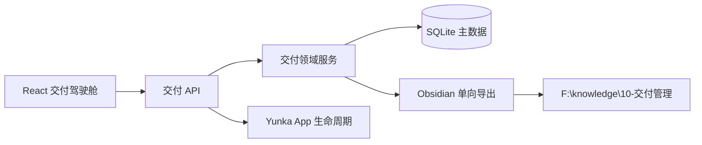

# 架构与数据边界

## 主数据与投影

`backend/data/iot-delivery.db` 是任务状态的唯一主数据源。Obsidian 导出器只写入 `10-交付管理/` 下带来源标记的页面；不会读取、合并或反向解释这些页面，因此手工编辑生成区不会成为任务事实。

一次事项包含：规划、方案、ADR 决策、阻塞项、关卡证据、发布验证与复盘。领域服务在每次写入后调用导出器；应用启动时还会全量刷新一次，以修复中断或版本升级后留下的旧投影。

## 运行时

`internal/runtime.Server` 将 HTTP 服务作为 `yunka.io/framework/core.RuntimeComponent` 注册。Yunka `core.App` 管理其启动、健康检查和关闭顺序；业务路由、SQLite 仓储和 Obsidian 导出保持显式依赖，不使用全局服务定位器。

## 关卡规则

| 关卡 | 可进入条件 | 结果 |
| --- | --- | --- |
| 方案评审、研发完成、测试通过、生产验证 | 必须至少附一条证据 | 更新当前关卡并投影 |
| 关闭 | 已生产验证且填写复盘 | 状态变为“已复盘关闭”并投影 |
| 受阻 | 记录非空阻塞项 | 状态变为“受阻”；清空后回到对应关卡状态 |
