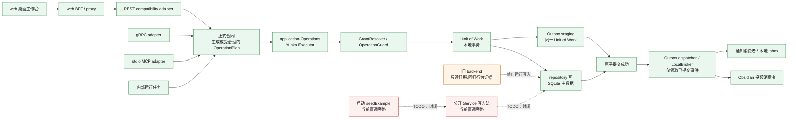

# S0-01-02：backend-yunka 目标边界与组件责任

- **状态：** Accepted target boundary
- **源码锚点：** `75099a0301d9f307efa7522ec808e274ff9506c4`
- **范围：** S0-01-02 架构决策切片；不实施合同收口、迁移、切换或运行代码改动。
- **ADR：** [ADR-0001](ADR/ADR-0001-backend-yunka-single-write-target.md)
- **证据基线：** [S0-01-01](../baseline/S0-01-WRITE-ENTRYPOINTS.md)（其 `CUR-*` 条目的逐项来源与 as-of commit 见同名 JSON）

## 读图规则

- **实线**表示目标态允许的业务写链（TGT），并非声称现已完全收口。
- **虚线红边**表示当前已知旁路或旧后端边界（CUR / TODO），不得当作目标态许可。
- “正式合同”包括生成合同或经治理批准的扩展 OperationPlan；S0-01-03 已将 Project/Release/Sprint/Milestone 的**创建**操作纳入生成合同，其他手写扩展 plan 仍只是 CUR 事实。详见 [S0-01-03 合同切片](S0-01-03-GENERATED-PLANNING-CREATES.md)。

## 目标写入边界图（TGT）与当前例外（CUR / TODO）

## 当前事实与目标约束的对账

| ID | 分类 | 已验证事实或已接受约束 | 证据 / 影响 |
| --- | --- | --- | --- |
| CUR-REST-01～10 | 当前事实 | REST 注册了写路由，handler 经 `Operations` 进入业务路径；关卡与关闭分支有方法守卫缺陷。 | [S0-01-01](../baseline/S0-01-WRITE-ENTRYPOINTS.md)；[routes](../../backend-yunka/internal/httpapi/handler.go#L65-L88)；[actions](../../backend-yunka/internal/httpapi/handler.go#L252-L286) |
| CUR-GRPC-01～04 | 当前事实 | 四个生成写 RPC 由生成 adapter 以 `ExecuteTyped` 调用 executor。 | [S0-01-01](../baseline/S0-01-WRITE-ENTRYPOINTS.md)；[RPC executor](../../backend-yunka/internal/delivery/transport/rpc/zz_yunka_management_operation_executor_gen.go#L38-L70) |
| CUR-MCP-01～10 | 当前事实 | MCP 写工具先建立本地已认证 principal，再调 `Operations`。 | [tools](../../backend-yunka/internal/mcpserver/server.go#L62-L89)；[create example](../../backend-yunka/internal/mcpserver/server.go#L103-L109) |
| CUR-INT-01～05 | 当前事实 | bootstrap 装配 executor、SQLite transaction factory、Outbox dispatcher 和运行组件。 | [assembly](../../backend-yunka/internal/bootstrap/application.go#L106-L116)；[runtime](../../backend-yunka/internal/bootstrap/application.go#L175-L202) |
| CUR-SVC-01～12 | 当前事实 / TODO | 公开 `Service` 写方法是可进程内直调的旁路面；必须由后续任务封闭或限制，不能描述为已修复。 | [catalog](../baseline/S0-01-WRITE-ENTRYPOINTS.json)；[example](../../backend-yunka/internal/delivery/service.go#L54-L65)；[Sync](../../backend-yunka/internal/delivery/service.go#L1421-L1429) |
| CUR-INT seed | 当前事实 / TODO | `seedExample` 直接调用 `Service.Create`，不天然经过 Operation Executor。 | [bootstrap](../../backend-yunka/internal/bootstrap/application.go#L71-L79)；[seed](../../backend-yunka/internal/bootstrap/application.go#L374-L390) |
| TGT-WRITE-01 | 已接受目标 | 每个业务写必须是“正式合同 → Operations / Executor → 授权 → 同一 Unit of Work 内 repository 写与 Outbox staging 并列原子提交 → 提交后 dispatcher”。 | [ADR-0001](ADR/ADR-0001-backend-yunka-single-write-target.md) |
| TGT-WRITE-02 | 已接受目标 | transport 不得直连 repository，不得复制授权、事务或 Outbox 策略。 | [ADR-0001](ADR/ADR-0001-backend-yunka-single-write-target.md) |
| TGT-LEGACY-01 | 已接受目标 | 旧 `backend/` 只作迁移、回归和行为证据；未来不得作为运行时写入者，不新增功能；阶段 0 不删除。 | [S0-00 来源清单](../baseline/SOURCE-MANIFEST.json)；[ADR-0001](ADR/ADR-0001-backend-yunka-single-write-target.md) |

## 组件责任表

| 组件 | 当前证据（CUR） | 目标责任（TGT） | 禁止 / 待办 |
| --- | --- | --- | --- |
| web / BFF | web 的 `/api/*` 为本地工作台代理入口；S0 未启动。 | 仅做调用编排、会话/请求转发和展示；业务写必须送入 REST 的正式合同。 | 不得直连 SQLite/repository，不得将 BFF 作为授权或持久化替代。 |
| REST | 注册业务 HTTP 路由；`Operations` 作为 service 参数。 | 仅将 HTTP 请求适配为正式合同调用、映射错误与响应。 | 不得直接持久化；修复方法守卫属后续任务。 |
| gRPC | 生成 adapter 使用 `ExecuteTyped`。 | 以正式 protobuf/OperationPlan 为首选写合同入口。 | 不得另建绕过 executor 的 RPC 写实现。 |
| MCP | 写工具建立已认证 principal 后调用 lifecycle/Operations。 | 仅将 stdio 工具输入适配为同一正式写合同。 | 不得把本地 principal 当作多用户身份体系；不得直连 repository。 |
| 内部运行任务 | runtime 有 Outbox、提醒等组件；seed 存在直接 Service 调用。 | 所有会改变业务主数据的任务必须进入正式合同和统一执行器。 | seed 直调是 TODO；不得以 scheduler/consumer 名义绕过授权和事务。 |
| 生成合同 | S0-01-03 已生成 Project/Release/Sprint/Milestone 创建合同；其余扩展 plan 仍手写。 | 明确写操作的输入、权限、事务与执行合同。 | 不得把其余手写扩展 plan 表述为已完成合同生成。 |
| application Operations | 当前为 adapter、executor 与 service 之间的用例边界。 | 唯一应用层写入口，负责选择正式 plan 并调用 executor。 | 不得暴露替代执行器的写通道。 |
| Yunka OperationPlan / Executor | 已构造 executor；生成 RPC 使用 `ExecuteTyped`。 | 强制执行计划的认证、权限、事务与执行语义。 | 不得由 transport 复制其职责。 |
| GrantResolver / OperationGuard | 本地 `GrantResolver` 被用于构造 authorizer。 | 以统一授权决定写操作是否允许。 | 不得在 handler/tool 内复制角色—权限判断。 |
| Unit of Work / Outbox staging | SQLite factory 实现 commit/rollback；Outbox 有 `EnqueueTx`。 | repository 写与 Outbox staging 在同一 Unit of Work 内并列参与原子提交；失败则两个结果均不得提交。 | 不得将 repository 写与 Outbox staging 拆成未受控的独立成功路径。 |
| repository | SQLite repository 以 context 取得 executor 并执行 SQL。 | 仅持久化主数据，并在同一 Unit of Work 内与 Outbox staging 并列执行；不拥有 transport、授权或业务流程。 | 不得由 Outbox 调用；不得对 web/BFF、REST、gRPC、MCP 或旧 backend 直接开放写入口。 |
| dispatcher / 投影 / 通知 | Outbox 消费者可投影/投递；通知 inbox 独立持久化且有幂等键。 | dispatcher 仅在原子提交成功后领取 Outbox 事件；投影与通知只消费这些已提交事件，形成单向读模型。 | dispatcher 不得观察未提交 staging；投影/通知不得反向成为主数据写源；外部目的地配置仍是运行时未知。 |
| 旧 backend | 当前仅是来源清单中的迁移/回归行为证据。 | 只读比较、迁移映射与回归基准。 | 不新增功能、不运行写入、不接受新合同；阶段 0 不删除。 |

## 失败关闭、回滚与验证边界

### 失败关闭

目标切换前，任何一个写用例无法证明“授权通过后进入同一 Unit of Work，repository 写与 Outbox staging 并列原子提交，dispatcher 仅领取已提交事件”的完整链条，或发现旧后端/transport 直写 repository，即为关闭条件：停止切换，保留旧后端只读对照，并记录缺口。不得以临时双写、替代直连或未授权重试绕过该条件。

### 回滚边界

S0-01-02 不进行数据迁移或路由切换，因而没有数据回滚动作。S0-07～S0-09 的正式迁移必须另行定义副本、对账、回滚窗口和权限；未经授权不得向 `backend/`、数据库或 Vault 回写。

### 本任务静态验证

1. 验证上述 CUR 链接对应 S0-01-01 资产及当前源码位置。
2. 验证 Mermaid 图可解析为单一有向边界图，且责任表覆盖指定组件。
3. 验证文档将 CUR、TGT 与 TODO 分开，且未宣称迁移、切换或旁路封闭已实施。
4. 验证 Markdown 内链/源码引用存在，并运行 `git diff --check`。

运行代码、合同生成、数据库/Vault 操作、服务启动、真实通知、迁移与切换均明确不在本任务范围。
